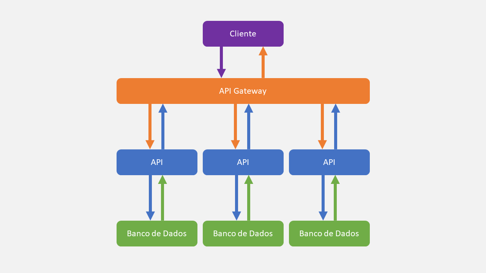
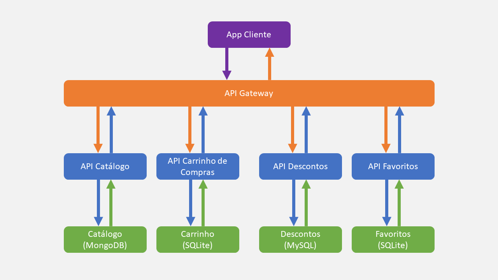

# Microsserviços

## ✨ Visão Geral
A arquitetura mais popular atualmente, se baseia em dividir as funcionalidades do sistema entre vários componentes completamente independentes, cada um tendo uma única responsabilidade e seu próprio banco de dados.

### Vantagens
- O Software se torna altamente escalável, já que sempre podem ser adicionados novos componentes.
- A manutenção é muito mais fácil, tendo em vista que as funcionalidades estão explicitamente divididas.
- O desenvolvimento pode ser realizado por várias equipes, já que cada componente é basicamente um sistema único.
- A segurança é maior, pois cada microsserviço são isolados uns dos outros, então ataques à segurança tendem a ser menos eficientes, além de ser muito comum a utilização de Gateways (que fornecem um único ponto de entrada para todos os clientes).

### Desvantagens
- O nível de dependências é extremo, qualquer componente do sistema com defeito, pode deixar várias partes do software sem funcionamento, mesmo que não quebre o programa. O que implica que mínimas modificações na estrutura de chamada das APIs podem comprometer inúmeros membros do sistema.
- Como cada componente é essencialmente uma API independente, cada uma deve ser chamada via HTTP, o que pode diminuir um pouco o desempenho e aumentar o consumo de rede.
- Para melhor eficiência de cada sistema individualmente, em vários quesitos, o ideal seria que cada componentes fosse implementado num Sistema Operacional (ou máquina) diferente, o que nem sempre é possível para o orçamento de quem utiliza a arquitetura.

### Arquitetura

Os microsserviços são bem independentes, embora possam sim utilizar outros componentes para ações específicas, que podem ser acessados pelo Gateway (por questões de segurança).

Para um melhor entendimento, vamos exemplificar a arquitetura.

## 🪄 Exemplo Prático
A arquitetura de uma aplicação de sistema de compras (similar à Shopee ou Amazon), que precisa de:
- Catálogo de Produtos.
- Carrinho de Compras.
- Pagamento.
- Lista de Favoritos.

