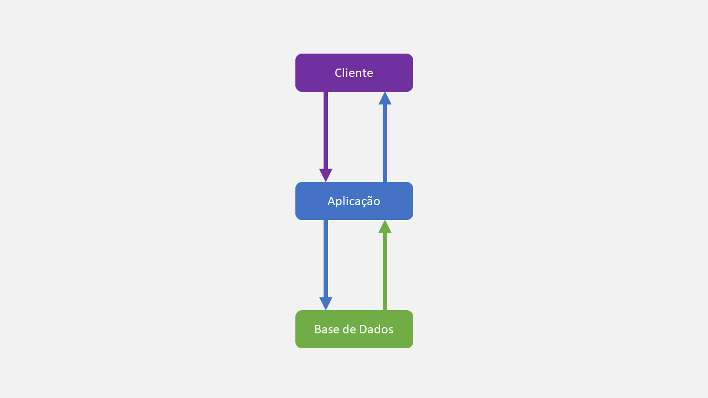

# Monólito

## ✨ Visão Geral
A arquitetura mais comum e famosa do desenvolvimento de software, que se baseia em ter todo sistema e funcionalidades do projeto, numa única base de código.

É claro que você pode utilizar outros serviços e APIs externas, ou até mesmo vários bancos de dados, desde que tudo se concentre na aplicação única, onde somente ela deve fornecer ao cliente todas as funcionalidades, acesso a dados e camadas de apresentação.

## 🪄 Exemplo Prático
