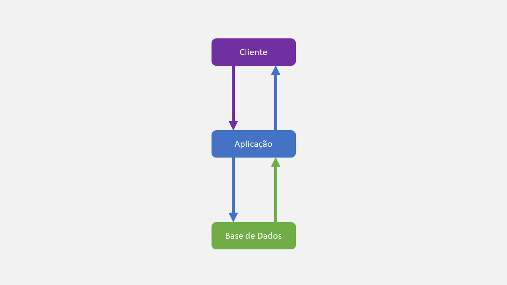
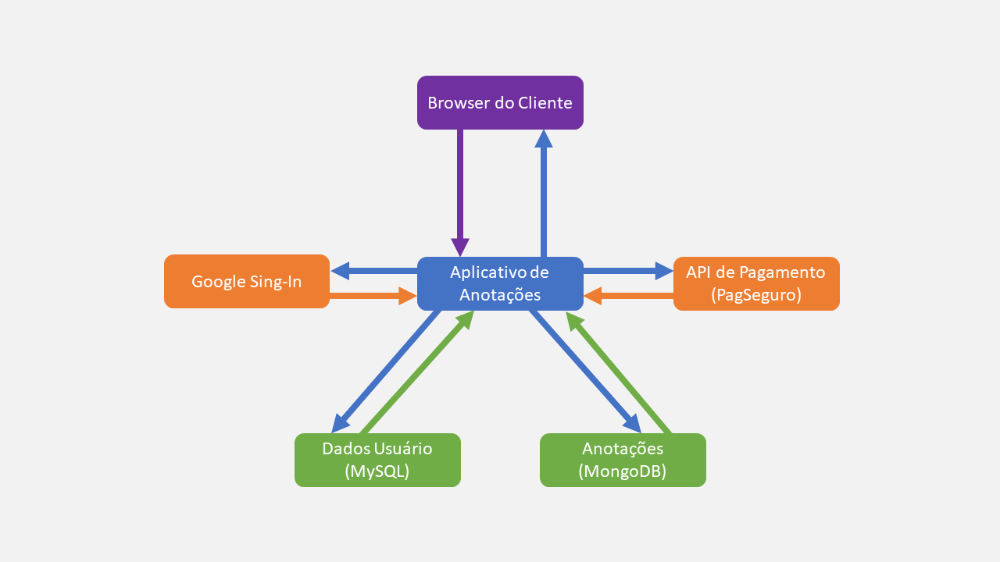

# Monólito

## ✨ Visão Geral
A arquitetura mais comum e famosa do desenvolvimento de software, que se baseia em ter todo sistema e funcionalidades do projeto, numa única base de código.

### Vantagens
- Ela tende a ser ideal para se criar projetos rápidos ou relativamente pequenos, como um por exemplo: um MVP.
- Mesmo em projetos grandes com múltiplas funcionalidades, ela tende a ter a vantagem de velocidade de comunicação entre as partes, já que não depende da comunicação por rede como outras arquiteturas.
- Evitam com eficiência as redundâncias de código, por todas as partes utilizarem as mesmas interfaces e classes de dados.

### Desvantagens
- Projetos monolíticos maiores tendem a ser desorganizados, de difícil manutenção e escalabilidade. O que pode ser minimizado com uma boa modularização.
- Há sérios perigos de quebra do sistema, um módulo com mau funcionamento pode comprometer toda execução do software.

### Arquitetura

- 🟣 **Cliente**: Usuário que vai requisitar recursos da aplicação.
- 🔵 **Aplicação**: Sistema completo com todas as funcionalidades.
- 🟢 **Banco de Dados**: Um banco de dados com informações salvas pela aplicação.

É claro que você pode utilizar outros serviços e APIs externas, ou até mesmo vários bancos de dados, desde que tudo se concentre na aplicação única, onde somente ela deve fornecer ao cliente todas as funcionalidades, acesso a dados e camadas de apresentação.

Para um melhor entendimento, vamos exemplificar a arquitetura.

## 🪄 Exemplo Prático
A arquitetura de uma aplicação de anotações (similar ao Notion ou Obsidian), que precisa de:
- Login com a conta do Google.
- Sistema de pagamento (para versões PRO e recursos diversos).
- Armazenar dados pessoais e das anotações, dos usuários.

> [!IMPORTANT]
> É um exemplo simples e genérico, não leve tudo ao "pé da letra".  
> Não precisa ter tudo que usei, ou pode ter bem mais do que isso.
