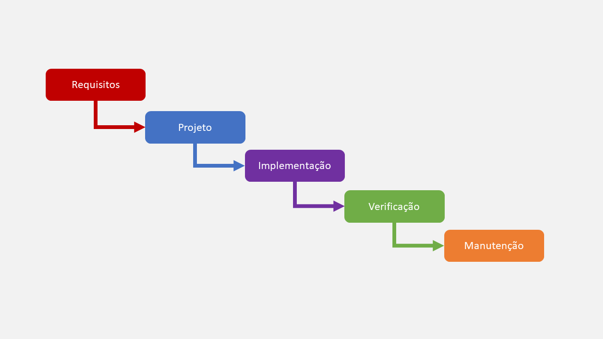

# Cascata

## ✨ Visão Geral
É um modelo linear de desenvolvimento, se baseia em um planejamento rígido dividido por fases, onde é desenvolvido uma por vez, sem pular etapas.

### Vantagens
- É bem simples e fácil de entender.
- É eficiente para projetos com requisitos bem definidos e que não vão mudar.
- É fácil de gerenciar, cada fase tem um responsável.

### Desvantagens
- Inflexível, pois uma vez terminada a fase, não é possível voltar e fazer alterações.
- Mudanças nos requisitos são problemáticas, fazem fases precisarem ser repetidas, atrasando os prazos e aumentando os custos.
- Como o software é desenvolvido como um todo, é difícil o manter atualizado com as tecnologias e novos requisitos.

### Representação Visual

- 🔴 **Requisitos**: é uma lista, onde é levantado tudo que o cliente quer que o software contenha, dividindo entre requisitos funcionais e não funcionais. Ainda nessa etapa, os requisitos são verificados pela equipe (para saber se são possíveis de serem realizados) e validados pelo cliente (para saber se é isso mesmo que ele quer), após isso um contrato de serviço é firmado com prazo e custo.

- 🔵 **Projeto**: é a etapa onde será projetado o software antes de codificar, nela é definido quais arquiteturas, padrões, diagramas, protótipos de telas e tecnologias serão utilizados para representar e construir o sistema.

- 🟣 **Implementação**: a codificação de fato, programação, configurações de servidores, criação de bases de dados etc.

- 🟢 **Verificação**: o software é analisado pela equipe para verificar se cumpriu todos os requisitos, e passa por uma rotina de testes para garantir o menor número possível de falhas e bugs.

- 🟠 **Manutenção**: é a etapa onde o software já está pronto e lançado no mercado, agora será corrigido bugs e feito atualizações, dependendo de como foi feito o contrato do projeto.
