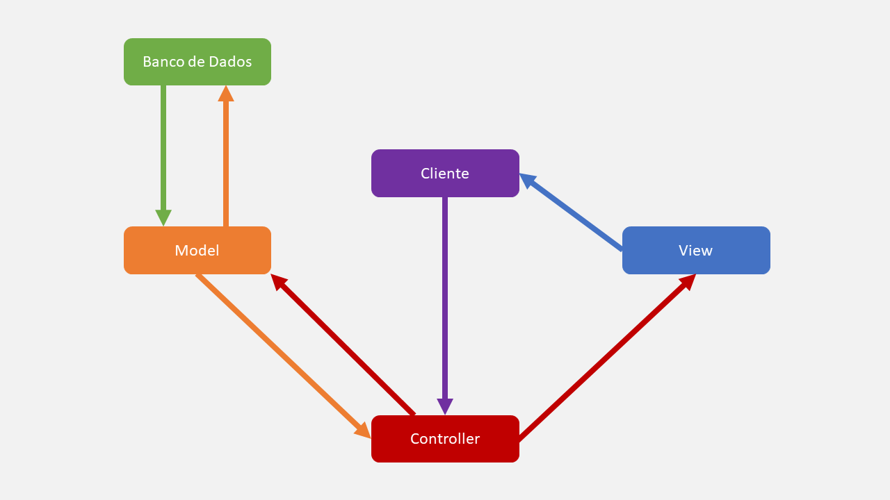

# MVC

## ✨ Visão Geral
O MVC, ou Model-View-Controller, é um padrão bem popular no meio do desenvolvimento de aplicações web, tendo a premissa de dividir o sistema de software em 3 partes.

### Vantagens
- Separa as responsabilidades do sistema, tornando mais escalável e fácil de manter.
- O código de cada camada, pode ser reutilizado em outros aplicativos, o que pode economizar tempo.
- O modelo é altamente flexível, podendo se adaptar a qualquer aplicativo e arquitetura.

### Desvantagens
- Cria dependências entre camadas, o que pode dificultar a manutenção.
- Relativamente complexo, especialmente para aplicações grandes.
- Pode impactar negativamente o desempenho da aplicação, num contexto com um alto tráfego de dados e solicitações de usuários.

### Arquitetura

- 🟣 Cliente: Usuário que vai requisitar recursos da aplicação.
- 🔴 Controller: Quem gerencia as requisições do usuário, e as interações gerais entre o Model e a View.
- 🟠 Model: Classes de dados, que contemplam as regras de negócio, além de interagir diretamente com o banco de dados.
- 🔵 View: Resposta à requisição do usário (usando os dados do Model), podendo ser em HTML, JSON, XML, TXT etc.
- 🟢 Banco de Dados: Um banco de dados com informações salvas pela aplicação.

